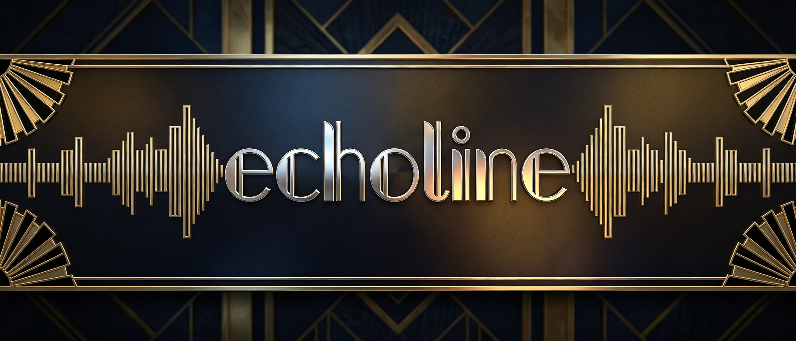

# Echoline

> **Echoline is a continuation of [speaches](https://github.com/speaches-ai/speaches) sponsored by [Vowel](https://vowel.com).**

`echoline` is an OpenAI API-compatible server supporting streaming transcription, translation, and speech generation. Speech-to-Text is powered by [faster-whisper](https://github.com/SYSTRAN/faster-whisper) and for Text-to-Speech [piper](https://github.com/rhasspy/piper) and [Kokoro](https://huggingface.co/hexgrad/Kokoro-82M) are used. This project aims to be Ollama, but for TTS/STT models.

See the full documentation for detailed instructions: [echoline.vowel.to](https://echoline.vowel.to/)

## Features

- OpenAI API compatible. All tools and SDKs that work with OpenAI's API should work with `echoline`.
- Audio generation (chat completions endpoint) | [OpenAI Documentation](https://platform.openai.com/docs/guides/realtime)
  - Generate a spoken audio summary of a body of text (text in, audio out)
  - Perform sentiment analysis on a recording (audio in, text out)
  - Async speech to speech interactions with a model (audio in, audio out)
- Streaming support (transcription is sent via SSE as the audio is transcribed. You don't need to wait for the audio to fully be transcribed before receiving it).
- Dynamic model loading / offloading. Just specify which model you want to use in the request and it will be loaded automatically. It will then be unloaded after a period of inactivity.
- Text-to-Speech via `kokoro` and `piper` models.
- GPU and CPU support.
- [Deployable via Docker Compose / Docker](https://echoline.vowel.to/installation/)
- [Realtime API](https://echoline.vowel.to/usage/realtime-api)
- [Voice Activity Detection](https://echoline.vowel.to/usage/vad/) (batch and streaming)
- [Highly configurable](https://echoline.vowel.to/configuration/)

Please create an issue if you find a bug, have a question, or a feature suggestion.

## Demos

> **Note:** The demo videos below are the original ones from the original [speaches](https://github.com/speaches-ai/speaches) repository. They demonstrate the core functionality that Echoline has inherited and built upon.

### Realtime API

https://github.com/user-attachments/assets/457a736d-4c29-4b43-984b-05cc4d9995bc

(Excuse the breathing lol. Didn't have enough time to record a better demo)

### Streaming Transcription

TODO

### Speech Generation

https://github.com/user-attachments/assets/0021acd9-f480-4bc3-904d-831f54c4d45b

## Container Image

Echoline is published as a container image to GitHub Container Registry:

**`ghcr.io/vowel/echoline`**

Available tags:
- `latest-cuda` - CUDA-enabled image (recommended for GPU)
- `latest-cpu` - CPU-only image
- `latest-cuda-12.6.3` - Specific CUDA 12.6.3 version
- `latest-cuda-12.4.1` - Specific CUDA 12.4.1 version
- Versioned tags (e.g., `v0.9.0-cuda`, `v0.9.0-cpu`)

## Installation

### Docker Compose (Recommended)

Download the necessary Docker Compose files:

**CUDA:**
```bash
curl --silent --remote-name https://raw.githubusercontent.com/vowel/echoline/master/compose.yaml
curl --silent --remote-name https://raw.githubusercontent.com/vowel/echoline/master/compose.cuda.yaml
export COMPOSE_FILE=compose.cuda.yaml
```

**CPU:**
```bash
curl --silent --remote-name https://raw.githubusercontent.com/vowel/echoline/master/compose.yaml
curl --silent --remote-name https://raw.githubusercontent.com/vowel/echoline/master/compose.cpu.yaml
export COMPOSE_FILE=compose.cpu.yaml
```

Start the service:
```bash
docker compose up --detach
```

### Docker

**CUDA:**
```bash
docker run \
  --rm \
  --detach \
  --publish 8000:8000 \
  --name echoline \
  --volume hf-hub-cache:/home/ubuntu/.cache/huggingface/hub \
  --gpus=all \
  ghcr.io/vowel/echoline:latest-cuda
```

**CPU:**
```bash
docker run \
  --rm \
  --detach \
  --publish 8000:8000 \
  --name echoline \
  --volume hf-hub-cache:/home/ubuntu/.cache/huggingface/hub \
  ghcr.io/vowel/echoline:latest-cpu
```

### Python (requires `uv` package manager)

```bash
git clone https://github.com/vowel/echoline.git
cd echoline
uv python install
uv venv
source .venv/bin/activate
uv sync
uvicorn --factory --host 0.0.0.0 echoline.main:create_app
```

## Usage

### Model Discovery and Download

Before using Echoline, you need to download a model for your specific task.

List available models:
```bash
export ECHOLINE_BASE_URL="http://localhost:8000"

# List all available models
uvx echoline-cli registry ls

# Filter by task (e.g., automatic-speech-recognition, text-to-speech)
uvx echoline-cli registry ls --task automatic-speech-recognition
```

Download a model:
```bash
# Download a speech-to-text model
uvx echoline-cli model download Systran/faster-distil-whisper-small.en

# Download a text-to-speech model
uvx echoline-cli model download speaches-ai/Kokoro-82M-v1.0-ONNX
```

### Speech-to-Text (Transcription)

**Using cURL:**
```bash
export ECHOLINE_BASE_URL="http://localhost:8000"
export TRANSCRIPTION_MODEL_ID="Systran/faster-distil-whisper-small.en"

curl -s "$ECHOLINE_BASE_URL/v1/audio/transcriptions" \
  -F "file=@audio.wav" \
  -F "model=$TRANSCRIPTION_MODEL_ID"
```

**Using Python with OpenAI SDK:**
```python
from pathlib import Path
from openai import OpenAI

client = OpenAI(base_url="http://localhost:8000/v1", api_key="cant-be-empty")

with Path("audio.wav").open("rb") as audio_file:
    transcription = client.audio.transcriptions.create(
        model="Systran/faster-distil-whisper-small.en",
        file=audio_file
    )

print(transcription.text)
```

### Text-to-Speech

**Using cURL:**
```bash
export ECHOLINE_BASE_URL="http://localhost:8000"
export SPEECH_MODEL_ID="speaches-ai/Kokoro-82M-v1.0-ONNX"
export VOICE_ID="af_heart"

curl "$ECHOLINE_BASE_URL/v1/audio/speech" \
  -s \
  -H "Content-Type: application/json" \
  --output audio.mp3 \
  --data @- << EOF
{
  "input": "Hello World!",
  "model": "$SPEECH_MODEL_ID",
  "voice": "$VOICE_ID"
}
EOF
```

**Using Python with OpenAI SDK:**
```python
from pathlib import Path
from openai import OpenAI

client = OpenAI(base_url="http://localhost:8000/v1", api_key="cant-be-empty")

model_id = "speaches-ai/Kokoro-82M-v1.0-ONNX"
voice_id = "af_heart"

response = client.audio.speech.create(
    model=model_id,
    voice=voice_id,
    input="Hello, world!",
    response_format="mp3"
)

with Path("output.mp3").open("wb") as f:
    f.write(response.content)
```

### Realtime API (Voice Chat)

Echoline implements the OpenAI Realtime API for interactive voice conversations. See the [Realtime API documentation](https://echoline.vowel.to/usage/realtime-api/) for full details.

Prerequisites:
- Set `CHAT_COMPLETION_BASE_URL` to an OpenAI-compatible endpoint (e.g., Ollama, OpenAI)
- Download both a STT model and a TTS model

Example WebSocket connection:
```javascript
const ws = new WebSocket(
  "ws://localhost:8000/v1/realtime?model=your-model&intent=conversation"
);

ws.onmessage = (event) => {
  const data = JSON.parse(event.data);
  console.log('Received:', data);
};
```

### Voice Activity Detection (VAD)

Echoline provides VAD capabilities via REST API and WebSocket streaming.

**Batch API:**
```bash
curl "$ECHOLINE_BASE_URL/v1/audio/speech/timestamps" \
  -F "file=@audio.wav"
```

**WebSocket Streaming:**
```python
import websockets
import json
import base64

async def test_vad_stream():
    uri = "ws://localhost:8000/v1/vad/stream?session_id=test-123"
    async with websockets.connect(uri) as ws:
        # Send audio chunk (PCM16 16kHz mono)
        audio = get_audio_chunk()
        await ws.send(json.dumps({
            "type": "audio",
            "audio": base64.b64encode(audio).decode(),
            "timestamp_ms": 1000
        }))

        # Receive VAD events
        async for msg in ws:
            event = json.loads(msg)
            print(f"VAD Event: {event}")
```

## Configuration

Echoline is highly configurable via environment variables. See the [Configuration documentation](https://echoline.vowel.to/configuration/) for all available options.

Key configuration options:
- `ECHOLINE_API_KEY` - API key for authentication (optional)
- `CHAT_COMPLETION_BASE_URL` - Base URL for chat completion proxy
- `CHAT_COMPLETION_API_KEY` - API key for chat completion provider
- `HF_TOKEN` - Hugging Face token for accessing private models
- `ECHOLINE_LOG_LEVEL` - Log level (DEBUG, INFO, WARNING, ERROR)

## Documentation

For comprehensive documentation, including:
- Detailed installation guides
- API reference
- Configuration options
- Integration guides (Open WebUI, etc.)
- Troubleshooting

Visit: **[echoline.vowel.to](https://echoline.vowel.to/)**

## License

MIT License - See [LICENSE](LICENSE) for details.
